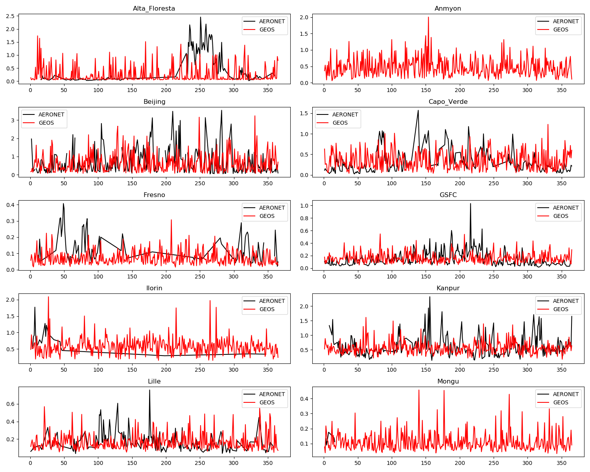

| . | . |
| - | - |
|  |  |

# Fall 2021 Python Course Series: Hackathon

## Objectives

The main objective of the Hackathon is to create a space where people
of various programming, engineering and science backgrounds, work together to write 
sample Python workflows to manipulate remote NASA data files on the cloud.
We want to engage and encourage Python learners in using
Data Science tools such as Pandas, Dask, Xarray, HoloViews,
BeautifulSoup, etc. to:
- Do web scraping to locate the data files they are interested in.
- Download or directly read (ideally) the remote files
- Carry out basic data analyses
- Perform interactive visualization.

We do not intend here to solve a Science/Engineering problem. 
We only want to write simple tools that can be used for prototyping and 
later be expended into Science/Engineering products. 
Each project is meant to address a specific need that will be beneficial to the 
Science/Engineering community.
The expectation is not to complete any project, but to engage participants so that
they can ask questions, bring their own perspectives in finding solutions, etc.

## How the Event is Organized

The event is virtual and will take place through Teams. We plan to form small groups of people, and each group
will work on its own project. The size of each group will depend on the 
number of participants and the available projects. We have that a group will have
no more than 7 people with one them being the Python "consultant" and another
one being the domain "expert" (of the topic/field involved in the project).

#### Tentative Schedule
- **09:00-09:45** General Presentation and Expectations
- **09:45-12:00** Team Work
- **12:30-13:00** Lunch Break
- **13:00-15:30** Team Work
- **15:30-16:00** Team Wrapping Up and Code Submission

## Learning Outcomes

At the end of this Hackathon, participants will:
- Imporove their Python skills.
- Be able to write simple Python applications from scratch.
- Be able to acess various NASA datasets within a Python code.
- Be comfortable using cloud platforms.

We also hope that beyond the solutions provided in this event,
the interations will generate questions that will challenge
participants to write readable, maintainable, usable, and expendable
Python codes.

## Possible List of Projects

Please click the link below to select the project you are interested in:

[https://forms.gle/CpBhHCD7aG6697F37](https://forms.gle/CpBhHCD7aG6697F37)

### <u>Project 1</u>: Disc-Less Reading of Remote AERONET Data

The code [read_aeronet_data.py](read_aeronet_data.py) allows the reading of AERONET
data at a specific site. The process involves writing the data in a file before
reading the file using Pandas. In this project, we want to use information available in:

[https://aeronet.gsfc.nasa.gov/cgi-bin/webtool_aod_v3](https://aeronet.gsfc.nasa.gov/cgi-bin/webtool_aod_v3)

[https://aeronet.gsfc.nasa.gov/print_web_data_help_v3.html](https://aeronet.gsfc.nasa.gov/print_web_data_help_v3.html)  

to accomplish the following:

- For a given site, do web scraping to provide:
     - Its Geographic Region
     - Its Country/State
     - Date range when data are available (for instance from March 15, 2015 to July 31, 2021).
- Read the data for the site by avoiding the creation of a temporary file. We want to directly read the data as a Pandas DataFrame or a Dask DataFrame. 
- As possible application, interpolate the 440 and 675 nm AOD to a commonly used wavelength of 550 nm and finally do various time series plots using Pandas.

We can expend the project by selecting a site and read the data one year at the time.
How could we take advantage of Dask to read the data in such a way?

#### Requirements
- Access to SMCE or any cloud platform.
- Web scraping, Pandas, visualization

### <u>Project 2</u>: Disc-Less Reading of Remote MERRA-2 Data Files

The code [read_merra2_data.py](read_merra2_data.py) accesses a remote MERRA2 file,
and dowloads the data in a local netCD-4 file. 
We want to be able to access and manipulate the data without having to write the data on the disc.
If it is not possible to avoid using the disc, could we use a temporary disc space location
(use for instance the `tempfile` module) where the files will be located and automatically deleted.
The manipulation involves extracting (with netCDF-4 or Xarray) the fields of interest and 
performing interactive visualization with HoloViews.

#### Requirements
- Access to SMCE or any cloud platform.
- Web scraping
- Pandas
- netCDF-4 or Xarray
- HoloViews
- Create and account at: [https://disc.gsfc.nasa.gov/earthdata-login](https://urs.earthdata.nasa.gov)
- Do the settings: [https://disc.gsfc.nasa.gov/earthdata-login](https://disc.gsfc.nasa.gov/earthdata-login)

### <u>Project 3</u>: Aerosol Optical Depth Time-Series Comparison from MERRA-2 Outputs and AERONET Observations

The code [compare_merra2_aeronet.py](compare_merra2_aeronet.py):
- Read the AERONET daily AOD data for 2010 on a couple of sites.
- Interpolates the 440 and 675 nm AOD to a commonly used wavelength of 550 nm.
- Read GEOS-5 (Icarusr6r6) model outputs and extract the values of AOT at the selected sites.
- Plot the time series of the AOD at each location from AERONET and GEOS-5.

The code assumes that the data files are local. 
We want to expend the capabilities of the code by reading remote files only.

#### Requirements
- Access to SMCE or any cloud platform.
- Web scraping
- Pandas
- netCDF-4 or Xarray
- Matplotlib
- Create and account at: [https://disc.gsfc.nasa.gov/earthdata-login](https://urs.earthdata.nasa.gov)
- Do the settings: [https://disc.gsfc.nasa.gov/earthdata-login](https://disc.gsfc.nasa.gov/earthdata-login)

## Accessing the SMCE Platform

To log in to the NASA Center for Climate Simulation (NCCS) Science Data Managed Cloud Environment (SMCE), click on the link:
 
[https://astg.mysmce.com](https://astg.mysmce.com)

It is assumed that you have already provided your gmail userid.
The system will ask you to provide your gmail password or give you automatic access if you are already logged in into gmail (through your browser).

We recommend that 2-4 days before the beginning of each class, you provide your gmail userid at:

[Provide your gmail userid HERE](https://forms.gle/JaCFNocQQP2WxYhL9)

